<h1 align="center">
   
  
   
  EasyBasin
   
</h1>

<h4 align="center">EasyBasin es un complemento de QGIS para la delimitación de cuencas hidrográficas.</h4>

  <a href="#introducción">Introducción</a> •
  <a href="#instalación">Instalación</a> •
  <a href="#puntos-clave">Puntos Clave</a> •
  <a href="#aplicación">Aplicación</a> •
  <a href="#créditos">Créditos</a> •
  <a href="#contacto">Contacto</a> •
  <a href="#support">Support</a>

## Introducción
<iframe width="700" height="315" src="https://www.youtube.com/embed/jjoCn050Zr8?si=B1bsr1u1Mo39yak4" title="YouTube video player" frameborder="0" allow="accelerometer; autoplay; clipboard-write; encrypted-media; gyroscope; picture-in-picture; web-share" referrerpolicy="strict-origin-when-cross-origin" allowfullscreen></iframe>

**EasyBasin** es un complemento de código abierto para QGIS desarrollado para optimizar el proceso de delimitación de cuencas hidrográficas y la obtención del **caudal máximo anual** mediante el **Método Racional** descrito en la [**Norma 5.2-IC DRENAJE SUPERFICIAL**](http://www.carreteros.org/normativa/drenaje/5_2ic2016/pdfs/5_2ic_fom_consolidada.pdf). Este plugin es **compatible con cualquier versión de QGIS igual o superior a 3.20**. EasyBasin **guía a los usuarios de forma intuitiva a través de todos los pasos necesarios para estimar el caudal máximo anual asociado al período de retorno indicado**. La interfaz de EasyBasin está dividida en dos ventanas principales: una **ventana inicial** que permite ejecutar los procesos geoespaciales para la delimitación de la cuenca hidrográfica y su red de drenaje, y una **ventana de resultados** que incluye todos los procesos, parámetros y datos de salida generados durante la aplicación del Método Racional. Esta ventana de resultados, se encuentra dividida en cuatro partes: **(1) CARACTERÍSTICAS DE LA CUENCA**, **(2) INTENSIDAD DE PRECIPITACIÓN**, **(3) COEFICIENTE DE ESCORRENTÍA** y **(4) CAUDAL MÁXIMO ANUAL**. Cada uno de estos pasos debe ser ejecutado de forma individual siguiendo el orden anteriormente descrito. **Una de las principales ventajas de EasyBasin es su fácil aplicación a partir de un único dato de entrada (punto de salida de la cuenca hidrográfica)**. 

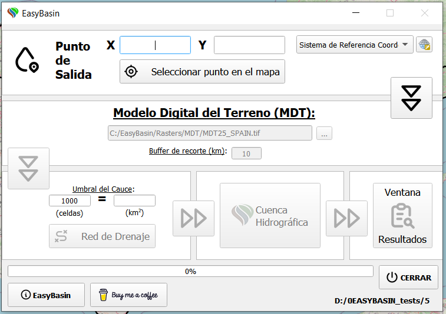

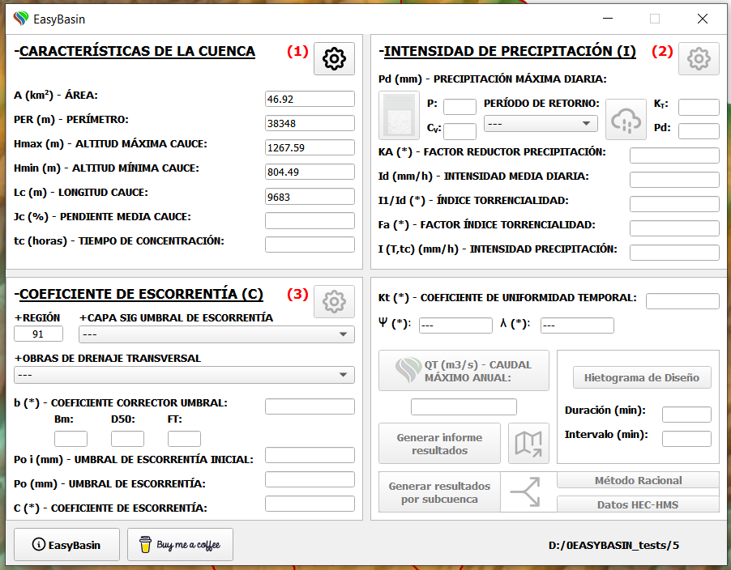

> [!IMPORTANT]
> **EasyBasin ha sido desarrollado para su aplicación dentro de la España peninsular**. Sin embargo, estamos dispuestos a colaborar con cualquiera que desee ampliar su área de aplicación en actualizaciones futuras. Haga sus sugerencias <a href="#contacto">aquí</a>.

## Instalación

### Descarga

* Puede descargar [**aquí**](https://github.com/AdrLBallesteros/EasyBasin/releases) la última versión del instalador de EasyBasin para Windows.
> [!WARNING]
> Se aconseja lanzar el ejecutable de instalación en **modo administrador** y desactivar el antivirus si fuera necesario.

### Configuración inicial

* **Antes de instalar EasyBasin**, es necesario descargar e instalar el programa [**QGIS 3**](https://www.qgis.org/en/site/index.html) en su versión mas reciente. 
> [!NOTE]
> Se recomienda utilizar la versión estable (LTR). Actualmente **QGIS 3.28 LTR**.

* Al ejecutar el instalador (**EasyBasin_v3_instalador.exe**) se creará una carpeta en **Disco C:** llamada **“EasyBasin”**.
> [!NOTE]
> Para evitar posibles errores, se recomienda conceder permisos de **control total** a esta carpeta **(Botón Derecho sobre C:\EasyBasin > Propiedades > Seguridad > Editar > Control total)**.

* Por último, dentro de QGIS procederemos a activar el complemento (plugin en inglés), para ello vamos a **Plugins > Manage and Install plugins… > All** y en el buscador escribimos “EasyBasin”.
  

## Puntos Clave

* **EasyBasin es un programa de un solo uso**, lo que significa que cuando se cierra el plugin la zona de trabajo de QGIS se limpiará y todas las capas visualizadas serán borradas. Sin embargo, **todos los archivos generados quedarán guardados en la carpeta del proyecto indicada**.

* Como dato de entrada, **solo es necesario conocer la ubicación del punto de salida de la cuenca hidrográfica**. Esta información puede ser **introducida por coordenadas o mediante su selección manual en el mapa base**.
  
* La **versión 3** de EasyBasin incluye **herramientas adicionales** como la **generación de los datos de entrada para el modelo hidrológico [HEC-HMS](https://www.hec.usace.army.mil/software/hec-hms/)** y la **generación automática de hietogramas de diseño** para una duración de tormenta, intervalo y período de retorno dado.

* Tanto los **resultados del Método Racional** como los **datos de entrada para HEC-HMS** pueden ser obtenidos a **escala de cuenca y de sub-cuenca**.

## Aplicación

1. Haga **clic en el icono de EasyBasin** situado en la barra de herramientas de QGIS para ejecutarlo. En primer lugar, se le pedirá que **indique una ruta para guardar la carpeta del proyecto**.

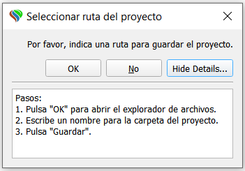

> [!IMPORTANT]
>EasyBasin está desarrollado para su **aplicación dentro de la España peninsular**, por tanto emplea el **sistema de proyección oficial en España (ETRS89 / UTM zona 30N**) para todos sus procesos y ofrece la posibilidad de utilizar un [**Modelo Digital del Terreno (MDT) por defecto**](https://doi.org/10.5281/zenodo.10687298) de 25 metros de resolución obtenido del [CNIG](http://centrodedescargas.cnig.es/CentroDescargas/index.jsp).

2. Para **introducir las coordenadas del punto de salida** se puede hacer de forma **manual**, indicando el valor **X e Y** del punto de salida y seleccionando el sistema de referencia de las coordenadas, o de forma **automática**, haciendo clic en el botón **SELECCIONAR PUNTO EN EL MAPA** y utilizando el mapa base como referencia. A continuación, hacemos **clic en la DOBLE FLECHA para activar el siguiente paso**.

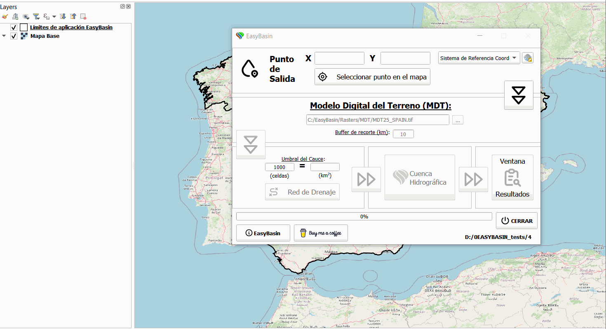

3. El siguiente paso consiste en la **generación de un buffer de recorte** a partir del punto de salida indicado. Para ello, tras introducir nuestro propio MDT o [descargar el MDT por defecto](https://doi.org/10.5281/zenodo.10687298), modificamos la **distancia del buffer de recorte (km)** para ajustarla al área que estimamos que ocupa la cuenca de estudio.  
>  [!TIP]
> **Todo este proceso puede ser visualizado a tiempo real en la zona de trabajo de QGIS**.

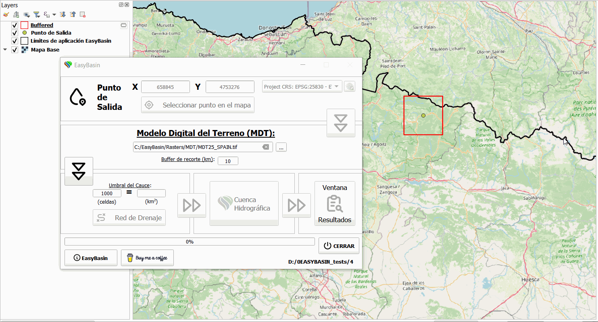

4. Obtenido el MDT recortado de la zona de estudio, procederemos a la **creación de la red de drenaje**. Para ello, **indicamos el “Umbral del Cauce”** **(número de celdas o área mínima que tienen que drenar a un punto para ser considerado como cauce)* y hacemos **clic en el botón RED DE DRENAJE**. 
>  [!TIP]
>**Este proceso puede ser repetido tanta veces como sea necesario hasta alcanzar la densidad de drenaje deseada**.

5. A continuación, hacemos **clic en la DOBLE FLECHA para corregir la ubicación del punto de salida (uniéndolo al cauce más cercano)** y  activar el proceso de generación de la cuenca hidrográfica. Al hacer **clic en el botón CUENCA HIDROGRÁFICA** la cuenca será delimitada y toda la información relevante sobre sus características físicas generada. **Al finalizar este proceso, la ventana de resultados se abrirá de forma automática**.

> [!WARNING]
> **La generación de la cuenca hidrográfica puede tardar varios minutos.**

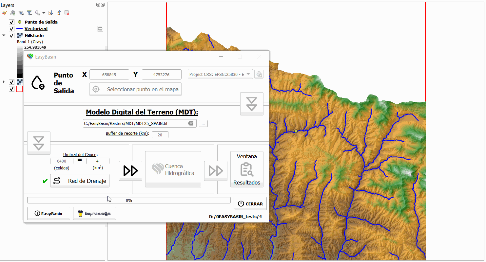

6. La ventana resultados se encuentra dividida en cuatro partes: **(1) CARACTERÍSTICAS DE LA CUENCA**, **(2) INTENSIDAD DE PRECIPITACIÓN**, **(3) COEFICIENTE DE ESCORRENTÍA** y **(4) CAUDAL MÁXIMO ANUAL**:
>
>* **(1) CARACTERÍSTICAS DE LA CUENCA**: En la **parte superior izquierda**, se muestra toda la información extraída del geoprocesamiento de las capas en QGIS. Haciendo **clic en el botón del ENGRANAJE (1)**, calculamos otras características físicas como la pendiente del cauce y el tiempo de concentración de la cuenca hidrográfica y activamos la segunda parte.

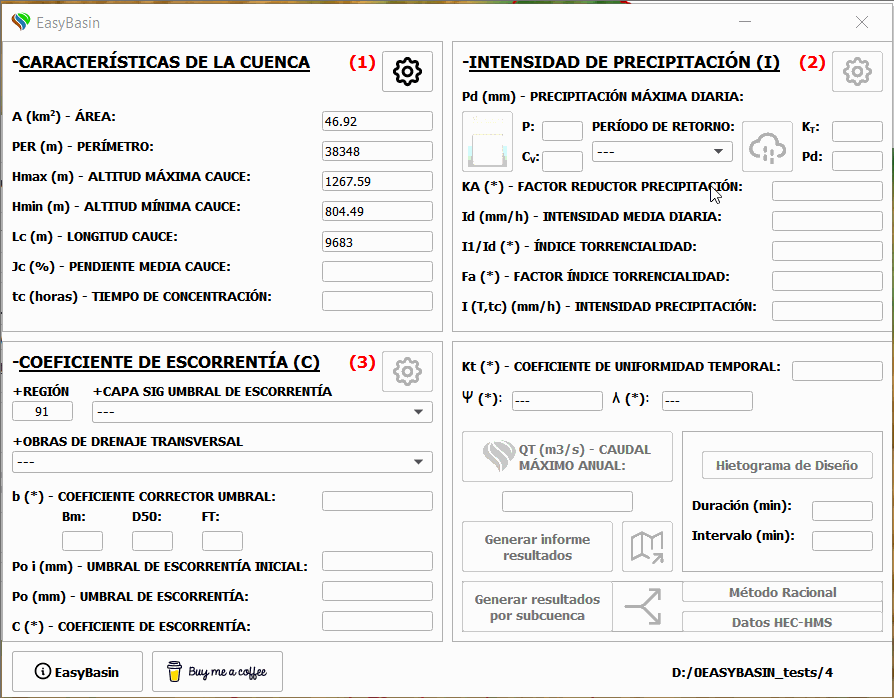

>* **(2) INTENSIDAD DE PRECIPITACIÓN**: En la **parte superior derecha**, debemos **seleccionar el período de retorno (T)** a utilizar (**2, 5, 10, 25, 50, 100 , 200, 500 años**) para calcular la **precipitación máxima diaria (Pd)**. En esta parte, la Pd puede ser obtenida mediante la **metodología propuesta en el documento oficial de [Máximas lluvias diarias en la España Peninsular](https://www.mitma.gob.es/recursos_mfom/0610300.pdf)**, extrayendo P y Cv de la ventana implementada en EasyBasin (**botón LIBRO**) o de **forma directa a partir de los mapas de lluvia máxima diaria generados por [Senent-Aparicio et al. (2023)](https://doi.org/10.1016/j.ejrh.2022.101308)**. A continuación, **clic en el botón NUBE** y **clic en el botón ENGRANAJE (2)** para calcular todos los parámetros del Método Racional relacionados con la intensidad de precipitación.

>  [!TIP]
> Para obtener la Pd de forma directa (**[Senent-Aparicio et al., 2023](https://doi.org/10.1016/j.ejrh.2022.101308)**) simplemente **selecciona el T** y haz **clic en el botón NUBE**.

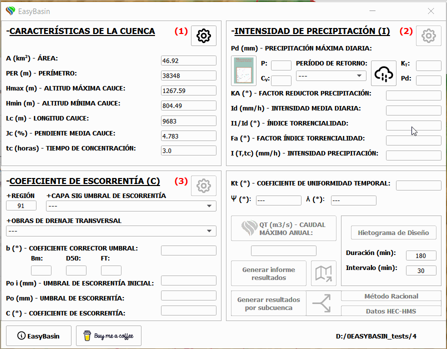

>* **(3) COEFICIENTE DE ESCORRENTÍA**: En la **parte inferior izquierda**, debemos **seleccionar tanto la capa raster del umbral de escorrentía a utilizar como el tipo de obra de drenaje**. **EasyBasin incluye tres capas del umbral de escorrentía distintas**: **[Raster P0 500m (MITECO)](https://www.miteco.gob.es/content/dam/miteco/es/cartografia-y-sig/ide/descargas/umbral_escorrentia_tcm30-176013.zip)** obtenido a partir de los usos del suelo del CORINE LAND COVER (CLC) 2000 y de acuerdo con la metodología expuesta en la publicación [Ferrer-Julià et al. (2004)](https://doi.org/10.1016/j.geoderma.2004.02.011); **Raster P0 100m (CLC2000)** de elaboración propia y obtenido a partir de los usos del suelo del CLC 2000; y **Raster P0 100m (CLC2018)** de elaboración propia y obtenido a partir de los usos del suelo del CLC 2018. A continuación, haciendo **clic en el botón del ENGRANAJE (3)** obtenemos todos los parámetros relacionados con el coeficiente de escorrentía del Método Racional.

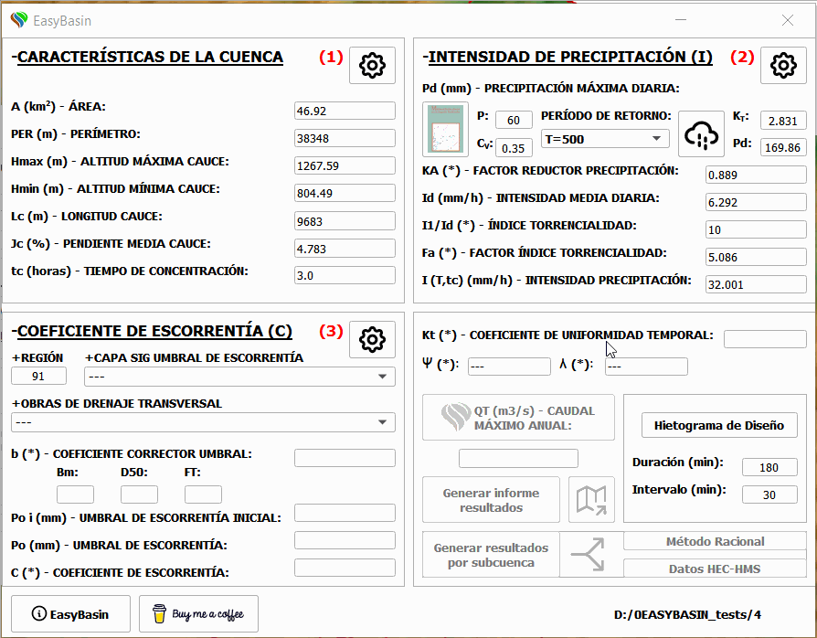

> [!NOTE]
> Si la zona de estudio se encuentra en las **Regiones 72, 821 y 822 del levante y sureste peninsular**, EasyBasin te preguntará si quieres utilizar la metodología específica propuesta por la norma 5.2-IC para el cálculo del caudal máximo anual en estas zonas.

>* **(4) CAUDAL MÁXIMO ANUAL**: En la **parte inferior derecha**, encontramos el **botón CAUDAL MÁXIMO ANUAL**, el cual permite **aplicar la fórmula propuesta por el Método Racional para el cálculo del caudal máximo anual correspondiente al periodo de retorno seleccionado**.

> [!NOTE]
> Si la **cuenca de estudio** supera el área recomendada para la aplicación del método racional según norma 5.2-IC (**>50 km2**). **EasyBasin mostrará un mensaje sugiriendo el uso de otro método hidrológico para el cálculo del caudal máximo anual**, tal como HEC-HMS. 

7. En esta **última parte** también encontramos los **botones de otras funcionalidades de EasyBasin**, tal como la **generación de informes de resultados** a escala de cuenca (Método Racional y datos de entrada HEC-HMS), la **creación de una imagen de la zona de estudio** y las **nuevas funcionalidades** para **generar el hietograma de diseño** y **obtener los resultados del Método Racional y datos de entrada de HEC-HMS por sub-cuenca**.

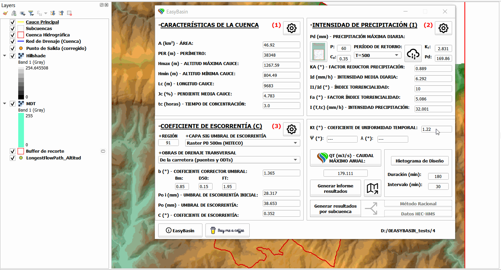

> [!WARNING]
> La **generación de resultados por subcuenca** aun se encuentra en **versión beta**, por lo que **si se produce algún error durante su ejecución prueba a utilizar un umbral del cauce mayor, lo que generará un menor número de sub-cuencas**.

8. **Otros botones** que podemos encontrar **tanto en la ventana inicial como en la ventana resultados** son el **botón HELP&ABOUT**, el **botón SUPPORT** y el **botón de acceso directo a la carpeta del proyecto**.

> [!IMPORTANT]
> Para **cerrar el plugin de EasyBasin** debes **pulsar el botón CERRAR de la ventana inicial**. Esta acción mostrará el siguiente mensaje:

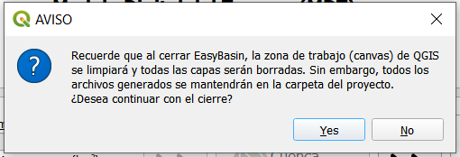

## Créditos

Este software utiliza los siguientes paquetes de código abierto:

* [**QGIS**](https://github.com/qgis/QGIS)

## Contacto

Para cualquier duda o sugerencia contactar con **alopez6@ucam.edu**.

## Support

Si encuentras útil este plugin, o si te ha ahorrado tiempo en tu trabajo, considera apoyarlo invitándome a un café. Gracias 😊

